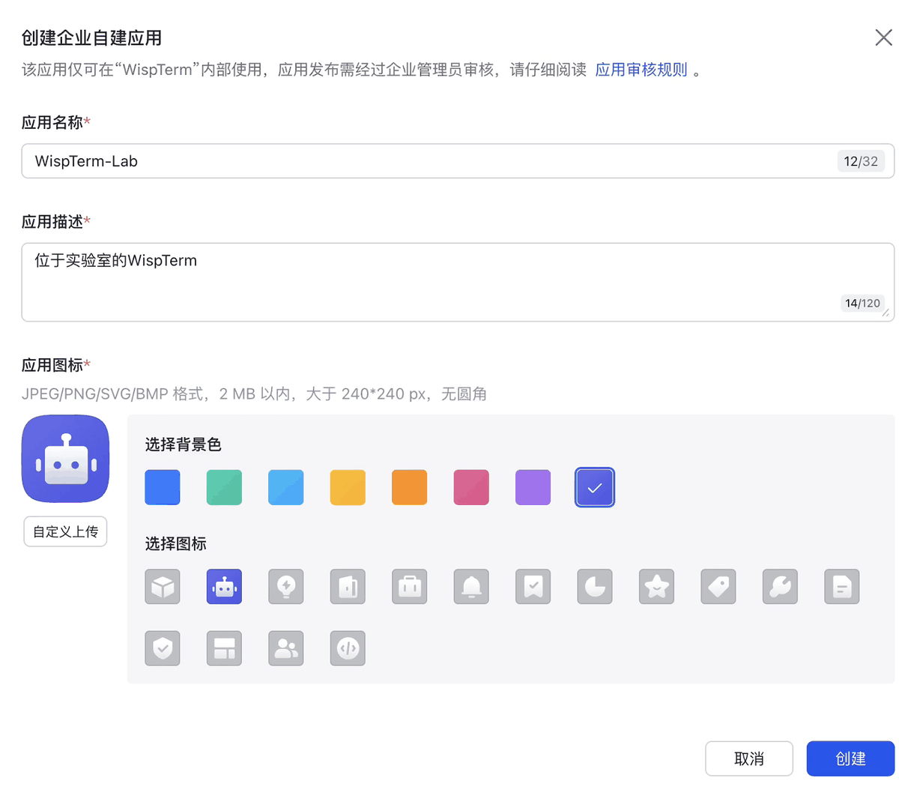
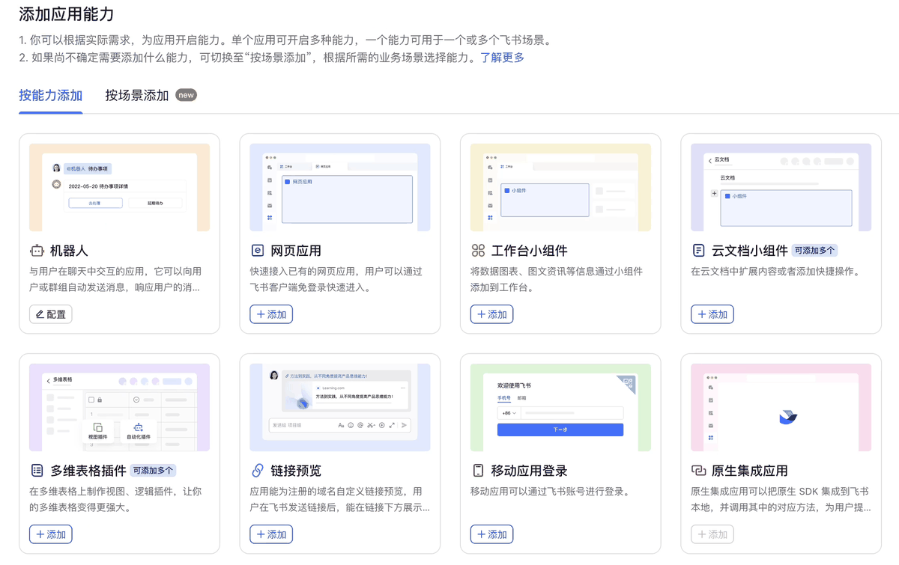
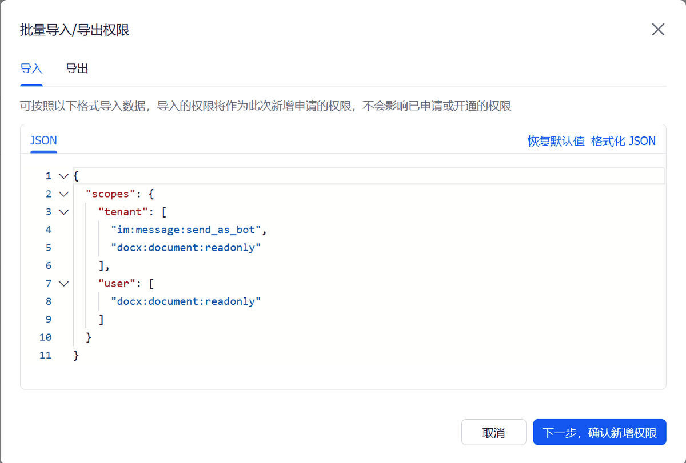
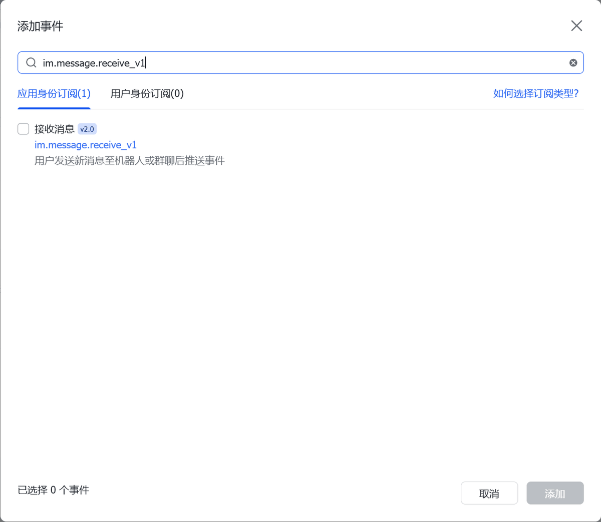
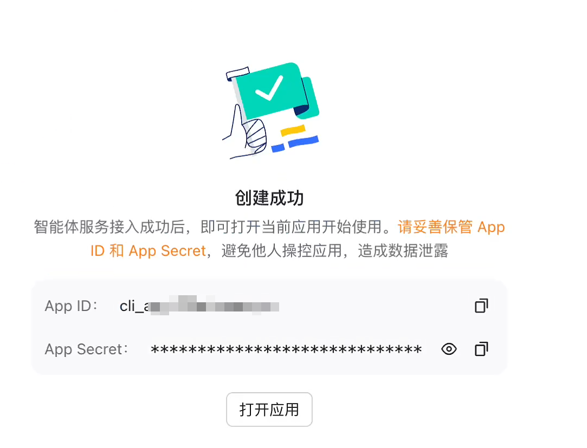

# Copilot

Open the session launcher with `Ctrl+Shift+T` and choose `Copilot`. WispTerm
opens the default AI profile directly in Agent mode. If no AI profile exists
yet, it opens the AI settings form first so you can configure the provider,
model, API key, and agent mode before the first launch.

Manage the default AI profile from Settings. Profile data is stored under the
platform config directory (`ai_profiles/`) — `%APPDATA%\wispterm\ai_profiles` on
Windows, `~/Library/Application Support/wispterm/ai_profiles` on macOS, or
`$XDG_CONFIG_HOME/wispterm/ai_profiles` (fallback `~/.config/wispterm/ai_profiles`)
on Linux — with fields hex encoded on disk.

Copilot can speak OpenAI-compatible Chat Completions, the OpenAI Responses API,
the Anthropic Messages API, or hand the whole conversation to an external agent
over ACP (see [External Agents via ACP](#external-agents-via-acp)). Set the
profile Protocol field to `chat_completions` (default), `responses`,
`anthropic`, or `acp`:

- `responses` profiles should use a base URL such as `https://api.openai.com/v1`
  or a full endpoint ending in `/responses`.
- `anthropic` profiles call `<base_url>/v1/messages`, authenticate with
  `x-api-key` + `anthropic-version` (not a Bearer token), and require a
  `Max Tokens` value (the profile default is `8192`). A base URL containing
  `api.anthropic.com` auto-selects the `anthropic` protocol; Anthropic-compatible
  third parties on other hosts (e.g. GLM/Zhipu) should set `anthropic` explicitly.
  Streaming is not yet supported for this protocol.

The built-in defaults are:

- Base URL: `https://api.deepseek.com`
- Model: `deepseek-v4-pro`
- Protocol: `chat_completions`
- System prompt: a platform-aware default compiled into the binary (defined in `src/platform/agent_prompt.zig`)
- Request mode: DeepSeek thinking enabled, `reasoning_effort = high`, non-streaming

The default agent prompt is platform-aware: on Windows it uses `powershell_exec`
for local commands; on macOS and Linux it uses `shell_exec`. All variants route
open SSH/WSL terminals through WispTerm's terminal tools, avoid pasting shell
commands into Codex/Claude Code REPLs, and keep Python environment management
on `uv`. For existing AI profiles, clear the System field to use the current
embedded default prompt on the next launch.

If an AI profile does not include an API key and its base URL points at
DeepSeek, WispTerm also checks `DEEPSEEK_API_KEY` in the process environment.
Responses with `reasoning_content` are shown as a muted reasoning block above
the assistant reply. This follows DeepSeek's
[thinking mode guide](https://api-docs.deepseek.com/zh-cn/guides/thinking_mode).
Completed requests show elapsed time in the Copilot status area, and token usage
when the provider returns OpenAI-compatible `usage` fields.

## Switching models in a running session

Use `/model` in an AI Chat tab or Copilot sidebar to open a picker of saved AI
profiles. Use `/model <name>` to switch directly by profile name; matching is
case-insensitive. The Chinese alias `/模型` works the same way. You can also
click the model label in the chat/Copilot header to open the picker.

The switch is local to the current session. It changes the provider/model fields
used by that chat, but it does not change `ai-default-profile`, the saved
profile on disk, or the conversation's persona/system prompt. After switching,
WispTerm asks the new model to summarize the prior transcript in the background
and collapses the old turns into a `Conversation summary` card. You can keep
typing while the summary runs; if the summary request fails, WispTerm keeps the
full raw history instead.

## External Agents via ACP

Instead of calling a model API directly, an AI profile can launch an external
coding agent (Claude Code, Codex, or any other [ACP](https://agentclientprotocol.com)
server) as a subprocess and let it drive the conversation. WispTerm speaks the
Agent Client Protocol over the agent's stdio: your messages become
`session/prompt` turns, the agent's streamed replies and tool calls render in
the normal chat transcript, and the agent process is reused across turns within
the session.

### Creating an ACP profile

Open the AI profile form (session launcher → AI settings) and cycle the
`Protocol` field to `acp`. An ACP profile only needs three fields:

- **Profile name** — any label (falls back to the command if left empty).
- **Protocol** — `acp`.
- **Command** — the agent launch command, run through your shell.

Base URL, API key, and model are not used — the form shows
`(not needed for ACP)` in those fields and they can stay empty. The agent
process brings its own model access and authentication (e.g. Claude Code uses
your existing `claude` login).

Two verified adapter commands:

| Agent | Command |
|-------|---------|
| Claude Code | `npx -y @zed-industries/claude-code-acp` |
| Codex | `npx -y @zed-industries/codex-acp` |

Landing on `acp` in the Protocol field prefills the Claude Code command if the
Command field is empty.

### Permissions

When the agent asks for permission (`session/request_permission`, e.g. before
editing a file or running a command), WispTerm shows the question as a blocking
prompt in the chat — pick an option to let the agent continue. Stopping the
turn cancels the pending prompt.

### Terminal capability

On macOS and Linux, WispTerm advertises the ACP `terminal/*` capability: when
the agent runs a command, it executes in a real WispTerm pane you can watch and
scroll. On Windows this capability is currently disabled (agents fall back to
their own command execution) until shell-argument escaping for `cmd.exe` is
implemented.

## Sessions

Open the command center with `Ctrl+Shift+P` and run `Copilot History` to reopen
WispTerm's own saved AI Chat tabs and Copilot sidebar conversations. The picker
groups rows by local date (`Today`, `Yesterday`, `Past Week`, `Earlier`), shows
relative update times, and keeps the list searchable by conversation title or
model. Press `Tab` to cycle the source filter between `All`, `Sidebar`, and
`Tab`; use Up/Down to move, `Enter` to reopen the selected row, `Delete` to
remove it, and `Esc` to return to the normal command center.

Open the session launcher with `Ctrl+Shift+T` and choose `Sessions` to browse
Codex, Claude Code, and Reasonix transcripts stored on a Local, WSL, or SSH
target. WispTerm connects to the selected target, scans `$HOME/.codex`,
`$HOME/.claude`, and `$HOME/.reasonix` for metadata, and loads a transcript
only when you open that row.

The `Subagent` category separates sessions whose title starts with `You are`;
those sessions still appear under `All`.

Use `Resume` to open a real terminal tab on the same target. WispTerm first
checks the original project directory recorded in the history file; if that
directory is missing, resume stops instead of falling back to `$HOME`.

The selected history row also supports local handoff actions: press `D` to
download the provider's raw history file, `M` to export the parsed transcript as
Markdown, or `A` to attach the transcript as a collapsed Copilot context card
for a follow-up question.

## In-context Copilot Sidebar

Press `Ctrl+Shift+A` (`Cmd+Shift+A` on macOS) on a terminal tab to toggle a
right-side AI copilot bound to the currently focused terminal. The copilot is
terminal-only — it does not open on a Copilot tab or other non-terminal tabs.

- Each terminal tab keeps its own copilot conversation and open/closed sidebar
  state. Closing the tab discards that conversation.
- Terminal actions default to the current terminal, so there is no tab to pick
  before asking. The copilot can still operate other terminals when you
  explicitly ask it to.
- Every message automatically includes a lightweight snapshot — the bound
  terminal's working directory plus its recent output — so the copilot has
  context without you pasting it.
- The copilot shares the default AI profile (same provider, model, and key) as
  Copilot.
- It occupies the right panel slot exclusively: opening the copilot hides the
  browser panel and the Markdown preview, and opening either of those hides the
  copilot.
- `Esc` stops an in-flight request. Pressing `Esc` again while idle hides the
  panel and returns focus to the terminal.
- Drag the panel's left edge to resize it; the width is shared across terminal
  tabs.

## Pasting Images (Vision)

Each AI profile has a **Vision** toggle (off by default). Enable it for a
profile that uses a vision-capable model, then press `Ctrl+Shift+V`
(`Cmd+Shift+V` on macOS) to paste an image from the clipboard into the chat
composer. The image is sent to the model as a multimodal block and is re-sent
with each follow-up turn so the model keeps seeing it. Pasting an image into a
profile whose model is not vision-capable is ignored with a log message and a
toast.

## Dropping Files into the Chat

Drag a local file onto a visible chat surface — a Copilot tab or the Copilot
sidebar — to insert that file's absolute path into the composer. The path is
quoted automatically when it contains spaces and is followed by a trailing
space, so you can keep typing your request after it.

## File editing

The AI agent can read and edit files directly:

- **read_file** — read a local or remote text file (returns numbered lines; supports an `offset`/`limit` line range for large files).
- **write_file** — create or overwrite a file with exact content.
- **edit_file** — replace an exact, unique string (or every occurrence with `replace_all`).

To edit a file on a remote SSH server, the agent passes the `surface_id` of an open SSH terminal tab; the operation runs on that host over the existing connection. Local files (no `surface_id`) resolve relative paths against the conversation's working directory. Writes and edits display a diff and, depending on the permission level (confirm / auto / full), may ask you to approve before applying.

SSH `edit_file` can use the optional `wispterm-filetool` helper on the remote host so the exact-string replacement is checked and applied server-side. Build it separately with `zig build wispterm-filetool -Dtarget=<remote-target>` and put `zig-out/bin/wispterm-filetool` on the remote server's `PATH`. If the helper is missing, WispTerm automatically falls back to the legacy SSH read/apply/write path.

## Long-term memory

Copilot keeps two tiers of long-term memory under the config directory
(`memory/global/` and `memory/projects/<key>/`): a **global** tier for facts
about you (preferences, recurring tools) and a **project** tier keyed by the
conversation working directory. At the start of each request a compact index of
both tiers is injected as background context; the model fetches full entries on
demand.

- The agent saves/updates/deletes memories with the `memory_save`,
  `memory_recall`, and `memory_delete` tools.
- `/remember <fact>` saves a fact deterministically (project tier when the
  conversation has a working directory, otherwise global).
- `/memory` lists the currently remembered facts.
- `/forget <name>` deletes a memory by its name.
- Set `ai-memory-enabled = false` in the config to turn the system off.

## Markdown Export

Use the command center to run `Export Copilot Markdown` for the full transcript,
including reasoning, tool details, and usage metadata.

Use `Export Copilot Markdown Clean` when you want a publishing-friendly record:
it writes only user prompts and the final AI answer, without thinking blocks,
tool output, or usage metadata. This is useful for notes, blog drafts, and
WeChat public account posts.

WispTerm opens a save dialog with a Markdown filename so you can choose
the destination path. After saving, the saved path is copied to the clipboard.

Agent tool commands run as hidden background child processes where possible, so
local PowerShell/cmd tool calls do not flash a separate console window.

## Agent Skills

Agent chats can load local skills from `skills/<skill-name>/SKILL.md` or
`plugins/skills/<skill-name>/SKILL.md` under the platform config directory
(`%APPDATA%\wispterm` on Windows, `~/Library/Application Support/wispterm` on
macOS, `$XDG_CONFIG_HOME/wispterm` or `~/.config/wispterm` on Linux), the
current working directory, or the directory containing the `wispterm`
executable.
Use `$skill-name your request` to explicitly load a skill for the next request.
The loaded skill is stored as a replayable tool result in the chat history, so
existing conversations stay reproducible even if the skill file changes later.

Open **Skill Center** to inspect prompt skills, imported executable tools, and
first-party WispTerm Agent tools such as web, terminal, file, docs, and memory
tools. Imported executable tools keep their existing enable/disable state.
First-party tool state is stored separately in `agent_tools.json`. Turning a
built-in tool off hides it from newly built AI request schemas/tool lists, and
runtime execution rejects stale or hallucinated calls for that disabled tool.

Third-party companion tools can use ordinary WispTerm entry points too. For
example, [Claude ChatMap](https://github.com/AHMUJia/claude-chatmap) is a local
Claude Code history dashboard that groups chats by folder and can resume a
selected chat in a WispTerm tab through `wisptermctl`. Community tools are not
bundled with WispTerm.

Local slash commands (handled in the panel, without calling the model):

- `/skills` lists discovered local skills.
- `/commands` lists all available slash commands.
- `/reload-skills` confirms that future skill calls will read from disk again.
- `/reload-commands` rescans the custom `commands/` directory.
- `/clear` clears the current conversation context (keeps the tab and profile).
- `/rewind` opens a picker for an earlier user prompt so you can edit and
  continue from that point.
- `/resume` opens the saved-conversation history picker.
- `/cwd` shows the effective working directory for the conversation.
  `/cwd <path>` sets a per-conversation directory override after resolving it
  to an existing absolute directory. `/cwd reset`, `/cwd default`, and
  `/cwd clear` remove the override and return to the default.
- `/model` opens the saved-profile picker; `/model <name>` switches directly.
  `/模型` is the Chinese alias.
- `/permission` shows the agent tool permission; `/permission ask`,
  `/permission auto`, or `/permission full` changes it at runtime.
  `ask` prompts for normal tool use, `auto` runs ordinary tools automatically
  while still confirming protected-path and dangerous commands, and `full`
  skips approval guard prompts. `confirm` remains accepted as an alias for
  `ask`.
- `/export` writes the conversation to Markdown (clean by default; `/export full`
  includes reasoning, tool details, and usage).
- `/loop <interval> <count> <prompt>` repeats a prompt after each fixed
  interval, then stops after `count` successful sends. The interval is an
  integer plus `s`, `m`, `h`, or `d`, for example `/loop 30m 8 check CI`.
  `/loop` lists this session's loop tasks, `/loop all` lists all loop tasks from
  Copilot, and `/loop stop <id>` or `/loop stop all` cancels tasks.
- `/watch <HH:MM> <prompt>` sends a prompt every day at that local time.
  `/watch <YYYY-MM-DD HH:MM> <prompt>` sends a one-shot prompt at that local
  time. `/watch` lists this session's watch tasks, `/watch all` lists all watch
  tasks from Copilot, and `/watch stop <id>` or `/watch stop all` cancels
  tasks.
- The Agent can also call `continue_later` when a terminal, SSH, Codex, Claude
  Code, or REPL task is still running. It schedules a one-shot continuation
  through the same `/watch` store, then resumes this session later and checks
  progress with `terminal_snapshot` before acting.
- `/remember <fact>` saves a long-term memory in the project tier when a
  working directory is set, otherwise in the global tier. `/记住` is the Chinese
  alias.
- `/memory` lists remembered facts. `/记忆` is the Chinese alias.
- `/forget <name>` deletes a remembered fact by name. `/忘记` is the Chinese
  alias.
- `/distill [topic]` or `/沉淀 [主题]` previews a reusable local skill distilled
  from the current conversation.

Reserved `$` lookup commands run in the panel and append a local tool message
without submitting a normal AI turn:

- `$websearch <query>` searches the web through Jina Search. It requires
  `jina-api-key` in the WispTerm config.
- `$webread <url | file path>` reads a web page or local file into Markdown
  through Jina Reader. It uses `jina-api-key` when set, but anonymous reads are
  allowed. Local-file conversions are cached by content under `.webread_cache`.
- `$pubmed <query>` searches NCBI PubMed and returns article metadata and
  abstracts. It does not require an API key.

The agent can also call the `websearch`, `webread`, and `pubmed` tools on its
own when those first-party tools are enabled in Skill Center.

## MCP Servers (external tools)

WispTerm acts as an MCP (Model Context Protocol) **host**: the Copilot can call
tools exposed by external MCP servers (GitHub, Context7, Playwright, a
filesystem server, your own, …).

Create `mcp.json` in your WispTerm config directory — the same directory as
`agent-access.local`:

- macOS: `~/Library/Application Support/<WispTerm>/mcp.json`
- Linux: `$XDG_CONFIG_HOME/<WispTerm>/mcp.json` (usually `~/.config/...`)
- Windows: `%APPDATA%\<WispTerm>\mcp.json`

It uses the standard `mcpServers` format (see [`mcp.json.example`](mcp.json.example)):

```json
{
  "mcpServers": {
    "context7": { "command": "npx", "args": ["-y", "@upstash/context7-mcp"] }
  }
}
```

Each server is a local program launched over stdio. Set `"enabled": false` to
keep a server configured but off. Tool calls honor the same approval prompt
(`ai-agent-permission`) as other agent tools.

**Deferred loading.** WispTerm does **not** spawn any MCP server at startup —
the system prompt just lists the configured-but-not-yet-activated servers (and
skills) by name, so the model knows what's available without paying a
handshake cost up front. The model activates a server on demand with the
built-in `mcp_activate` tool; the first activation of a server runs the real
discovery handshake and caches the result to `mcp_catalog.json` in the config
directory, so later activations (this session or a future one) are instant.
Running **Test connection** in the panel (below) performs the same discovery
handshake and writes the same cache — so testing a server after configuring it
means the catalog is already warm the first time the model activates it.

### Three ways to configure

- **In-app panel** — command palette → **MCP Servers**. The list is a filterable
  picker: **type** to filter, **↑/↓** to move, **Enter** to edit the highlighted
  server, **Space** to enable/disable it, **Esc** to clear the filter or close.
  The trailing rows run **New MCP Server**, **Edit mcp.json**, and **Close**. The
  add/edit form walks its rows with **Tab**/**↑↓** and activates with **Enter**;
  its action rows are **Save**, **Test connection** (runs the discovery handshake
  and shows the tool names or the failure reason), **Delete**, and **Cancel**, and
  **⌘V** pastes into the focused field. There is no separate save or reload step —
  every change (save, delete, enable/disable) is written to `mcp.json` and the
  tool cache is reloaded immediately.
- **Edit `mcp.json` directly** — for anything the form doesn't cover (remote
  servers, request headers), choose **Edit mcp.json** in the panel (or edit the
  file at the path above). The panel closes so it can't clobber your edits; reopen
  it to pick the changes back up.
- **Let the Copilot do it** — ask the Copilot "what MCP servers do I have?" or
  "add the jina MCP server". It uses the built-in `mcp_config` tool to list and
  configure servers (`list` / `add` / `remove` / `enable` / `disable`), writing
  `mcp.json` and reloading immediately. Mutations ask for approval unless the
  agent permission is `full`.

### Remote servers (via `mcp-remote`)

A hosted/HTTP MCP server is reached through the `mcp-remote` bridge, launched
over stdio like any other command. Jina's server works **without an API key**
(free tools like `search_jina_blog`, `primer`, `guess_datetime_url`,
`search_bibtex`, rate-limited), so this config is ready to use and can be typed
straight into the add form — Name `jina`, Command `npx`, Args
`-y mcp-remote https://mcp.jina.ai/v1`:

```json
{
  "mcpServers": {
    "jina": {
      "command": "npx",
      "args": ["-y", "mcp-remote", "https://mcp.jina.ai/v1"]
    }
  }
}
```

For higher rate limits and key-only tools (web/arXiv search, embeddings, PDF
extraction), add an auth header. Its value contains a space, which the form's
space-split Args field can't express, so add it by editing `mcp.json` (press
**o**):

```json
"args": ["-y", "mcp-remote", "https://mcp.jina.ai/v1", "--header", "Authorization: Bearer <YOUR_JINA_API_KEY>"]
```

Put the API key **directly in the args** (the file is local, like `~/.ssh`).
WispTerm spawns servers without a shell, so a `${ENV_VAR}` placeholder in args is
**not** expanded — use the literal key. After editing, press **r** in the MCP
Servers panel to reload.

**Troubleshooting.** MCP discovery and tool calls are logged under the `mcp`
scope. Build a diagnostic app and read the log:

```
zig build -Dtarget=aarch64-macos -Ddebug-console macos-app
# run it, then:
grep '(mcp)' "$HOME/Library/Application Support/wispterm/wispterm-debug.log"
```

You'll see one line per server (`discovered N tool(s)` or the failure reason)
and one per tool call. A server that fails to start/handshake is skipped, not
fatal — the log line tells you why.

Scope note: stdio only (local programs, or remote via `mcp-remote`); no native
HTTP/OAuth transport and no marketplace. The in-app panel edits simple
name/command/args servers; use direct `mcp.json` editing (by hand or via the
Copilot) for `env`, request headers, or other complex configs.

## Skill Distillation

Use `/distill`, `/distill <topic>`, `/沉淀`, or `/沉淀 <主题>` after a useful AI
Chat, Agent, or Copilot workflow to generate a candidate local `SKILL.md`.
WispTerm sends a redacted transcript to the configured AI provider, then shows a
local preview with the skill name, description, save path, body, and source
summary. The command itself is handled by the panel and is not submitted as a
normal chat prompt.

Automatic suggestions may appear after tool-heavy or clearly reusable tasks:

```text
This task looks reusable. Distill it into a skill?
```

When that suggestion is pending, press Enter on an empty AI Chat input to open
the same preview flow, or press Esc to ignore it. WispTerm never writes a skill
silently from an automatic suggestion.

Confirm or discard the preview explicitly:

- `/distill confirm` or `/沉淀 确认` writes the skill.
- `/distill cancel` or `/沉淀 取消` discards the candidate.

Distilled skills are saved only under the user config skills directory:
`<config>/skills/<slug>/SKILL.md` (`%APPDATA%\wispterm\skills` on Windows).
They are not written to `plugins/skills`, bundled resources, or repository
plugin directories. Existing skill directories are not overwritten; use a more
specific topic or remove the old skill first.

Before the distiller request and again before writing, WispTerm scans for API
keys, passwords, bearer tokens, Weixin context tokens, and common
`*_TOKEN`/`*_KEY` style secrets. Unredacted sensitive content blocks the write
instead of being saved.

## Custom Slash Commands

Add your own slash commands by dropping Markdown files in a `commands/`
directory under the platform config directory (`%APPDATA%\wispterm\commands` on
Windows, `~/Library/Application Support/wispterm/commands` on macOS, or
`$XDG_CONFIG_HOME/wispterm/commands` / `~/.config/wispterm/commands` on Linux),
the current working directory, or next to the `wispterm` executable. Each
`*.md` file is one command, named by its `name:` frontmatter field:

```markdown
---
name: review
description: review the current diff
---
Please review the current git diff for correctness and simplifications.
```

A command with no `action:` uses its body as a prompt template (submitted to the
model). A command may instead map to a built-in action with
`action: clear_context` | `restore_session` | `set_permission` | `export_markdown`.
Names that collide with a built-in command are ignored. Run `/reload-commands`
to pick up edits without restarting.

Release packages include `plugins/skills/inspect-computer-config`, which can be
loaded with `$inspect-computer-config` to summarize local OS, CPU, memory, GPU,
disk, and runtime details.

For Xshell-like terminal clipboard behavior, use:

```text
copy-on-select = true
right-click-action = paste
```

`right-click-action = copy-or-paste` copies when a terminal selection is active
and pastes when there is no selection.

## WeChat Direct Control

You can drive a Copilot conversation from WeChat. Run **Connect WeChat** from the
command center and scan the QR code to bind your account; WispTerm then polls
WeChat for incoming messages and feeds them to the bound conversation, replying
back over WeChat. The remaining command-center entries manage that binding:

- **WeChat: Start** — resume polling with the saved binding.
- **WeChat: Stop** — stop polling but keep the saved binding.
- **WeChat: Status** — show the current connection state.
- **WeChat: Unbind** — clear the stored binding.

Because replies are delivered to a phone, the `Export Copilot Markdown Clean`
output (prompts plus the final answer only) is a good fit for forwarding results.

## Feishu/Lark Direct Control

WispTerm can also receive messages from a Feishu self-built app and route them
to the active Copilot/Agent flow. In Feishu Open Platform, open your self-built
app, or create a new **enterprise self-built app** first:

```text
https://open.feishu.cn/app
```

For international Lark tenants, the corresponding Open Platform API domain is:

```text
https://open.larksuite.com
```

Create and publish the Feishu app first:

### Step 1: Create an enterprise self-built app

Log in to Feishu Open Platform and create an **enterprise self-built app**, for
example `WispTerm-Lab`.



### Step 2: Add the Robot capability

Open **Add app capabilities** and select **Robot**.



### Step 3: Import permissions

In **Permission management**, open **Bulk import/export permissions**, switch to
**Import**, and paste this JSON:

```json
{
  "scopes": {
    "tenant": [
      "application:application:self_manage",
      "application:bot.basic_info:read",
      "application:bot.menu:write",
      "cardkit:card:read",
      "cardkit:card:write",
      "contact:contact.base:readonly",
      "docs:document.comment:create",
      "docs:document.comment:delete",
      "docs:document.comment:read",
      "docs:document.comment:update",
      "docs:document.comment:write_only",
      "docx:document.block:convert",
      "docx:document:readonly",
      "docx:document:write_only",
      "drive:drive.metadata:readonly",
      "im:chat.members:bot_access",
      "im:chat:create",
      "im:chat:read",
      "im:chat:update",
      "im:message.group_at_msg.include_bot:readonly",
      "im:message.group_at_msg:readonly",
      "im:message.p2p_msg:readonly",
      "im:message.pins:read",
      "im:message.pins:write_only",
      "im:message.reactions:read",
      "im:message.reactions:write_only",
      "im:message:readonly",
      "im:message:send_as_bot",
      "im:message:send_multi_users",
      "im:message:send_sys_msg",
      "im:message:update",
      "im:resource",
      "wiki:node:read"
    ],
    "user": [
      "offline_access"
    ]
  }
}
```



### Step 4: Configure long-connection events

Open **Events & Callbacks → Event configuration** and select **Long connection**
mode.


Then add the event **Receive message** / `im.message.receive_v1`.



The long-connection status showing **connection failed** is expected at this
point because WispTerm has not been configured with the app credentials yet.

### Step 5: Publish the app

Open **App release → Create version**. Use version `1.0.0`, select **Robot** as
the default mobile and desktop capability, add any release note, and submit the
release. Feishu personal tenants usually publish immediately.

### Step 6: Copy credentials into WispTerm

After the app is published, copy the App ID and App Secret from Feishu:



### Step 7: Configure in WispTerm

Then configure WispTerm:

1. Open the command center with `Ctrl+Shift+P` (`Cmd+Shift+P` on macOS).
2. Type `feishu`.
3. Run **Feishu: Configure**.
4. Fill `App ID` and `App Secret`, then save.
5. Restart WispTerm. The Feishu long-connection channel starts only during app
   startup.


You can also set the same values in the config file or the process environment:

```text
feishu-enabled = true
feishu-app-id = cli_xxx
feishu-app-secret = your-app-secret
# Optional: restrict control to one Feishu open_id.
feishu-allowed-user = ou_xxx
```

If `feishu-app-id` or `feishu-app-secret` is empty, WispTerm falls back to the
`FEISHU_APP_ID` and `FEISHU_APP_SECRET` environment variables.

## Asking About WispTerm Itself

The agent can read WispTerm's own user documentation on demand through the
`wispterm_docs` tool. Ask a natural question such as "how do I change the font?"
or "what clipboard options exist?" and the agent first lists the available
topics (`faq`, `configuration`, `tabs-panels`, `ai-agent`, `file-explorer`,
`media`), then reads the relevant one and answers from it.

The docs are embedded in the WispTerm binary, so this works offline and without
the source tree. The system prompt only carries a one-line pointer to the tool;
the documentation text is loaded only when the agent calls `wispterm_docs`.
