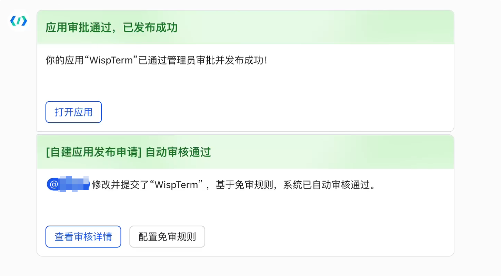
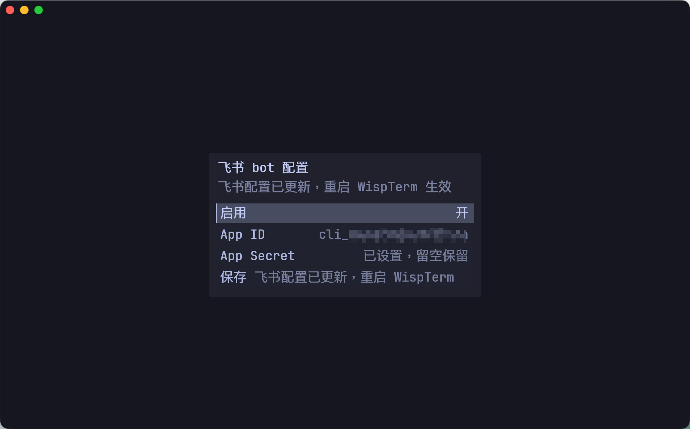

# AI 副驾与智能体

*[English](AI-Copilot) · 中文*

> 配置 AI 提供方、运行随上下文的副驾、管理权限与工作目录、使用技能与斜杠命令，并恢复历史会话。

## 打开 Copilot

按 `Ctrl+Shift+T` 打开会话启动器并选择 **Copilot**。WispTerm 会直接以 Agent 模式打开
默认 AI profile。如果还没有 AI profile，它会先弹出 AI 设置表单，让你在首次启动前配置
提供方、模型、API Key 和智能体模式。

## 配置 profile

在设置里管理默认 AI profile。profile 数据保存在平台配置目录的 `ai_profiles/` 下
（Windows 上 `%APPDATA%\wispterm\ai_profiles`，macOS 上
`~/Library/Application Support/wispterm/ai_profiles`，Linux 上
`$XDG_CONFIG_HOME/wispterm/ai_profiles` 或 `~/.config/wispterm/ai_profiles`），各字段在
磁盘上以十六进制编码。

## 提供方与协议

Copilot 支持兼容 OpenAI 的 **Chat Completions**、OpenAI 的 **Responses** API，以及
**Anthropic Messages** API。把 profile 的 Protocol 字段设为 `chat_completions`（默认）、
`responses` 或 `anthropic`：

- `responses` profile 使用形如 `https://api.openai.com/v1` 的 base URL，或以
  `/responses` 结尾的完整端点。
- `anthropic` profile 调用 `<base_url>/v1/messages`，用 `x-api-key` +
  `anthropic-version` 鉴权（而非 Bearer token），并需要一个 `Max Tokens` 值
  （profile 默认 `8192`）。base URL 含 `api.anthropic.com` 会自动选 `anthropic`；
  其它主机上的 Anthropic 兼容第三方（如 GLM/智谱）必须显式设 `anthropic`。该协议
  暂不支持流式。

## 默认值与 API Key

内置默认针对 DeepSeek：

- base URL `https://api.deepseek.com`，模型 `deepseek-v4-pro`，协议
  `chat_completions`。
- 开启 DeepSeek thinking，`reasoning_effort = high`，非流式。
- 一个与平台相关的系统提示编译进了二进制；在已有 profile 上清空 System 字段即可
  在下次启动时采用当前内置默认提示。

如果 profile 没有 API Key 且 base URL 指向 DeepSeek，WispTerm 还会检查环境变量
`DEEPSEEK_API_KEY`。带 `reasoning_content` 的响应会作为一段灰显的推理块显示在回复上方。
完成的请求会显示耗时；当提供方返回兼容 OpenAI 的 `usage` 时还会显示 token 数。

## Copilot 侧栏

在终端标签上按 `Ctrl+Shift+A`（macOS 上 `Cmd+Shift+A`）可切换绑定到当前终端的右侧 AI
副驾（仅限终端标签）。

- 每个终端标签保留**自己**的会话；关闭标签即丢弃。
- 终端动作默认针对当前终端 —— 无需先选标签。你明确要求时，副驾仍可操作其它终端。
- 每条消息都会自动附带绑定终端的工作目录和近期输出的轻量快照，省去手动粘贴上下文。
- 它与 Copilot 共享默认 AI profile（相同提供方、模型、Key）。
- 它独占右侧面板槽位：打开它会隐藏浏览器面板和 Markdown 预览，反之亦然。
- `Esc` 停止进行中的请求；空闲时再按一次 `Esc` 隐藏面板并把焦点交回终端。拖左边缘可调宽度。

## 粘贴图片（Vision）

每个 AI profile 都有 **Vision** 开关（默认关闭）。在使用视觉模型的 profile 上启用后，
按 `Ctrl+Shift+V`（macOS 上 `Cmd+Shift+V`）即可把剪贴板图片粘贴进聊天输入框。图片会作为
多模态块发送，并在之后每一轮都重新发送，使模型持续看到它。把图片粘贴进非视觉 profile 会
被忽略，并给出日志和提示。

## 把文件拖入聊天

把本地文件拖到可见的聊天界面上 —— Copilot 标签或 Copilot 侧栏 —— 即可把该文件的绝对
路径插入输入框。路径含空格时会自动加引号，并补一个尾随空格，方便你接着输入请求。

## 文件编辑

智能体可以直接读取和编辑文件：

- **read_file** — 读取本地或远程文本文件（返回带行号的内容；支持 `offset`/`limit` 参数以读取大文件的指定范围）。
- **write_file** — 创建或覆盖文件，写入精确内容。
- **edit_file** — 替换一段精确且唯一的字符串（用 `replace_all` 可替换全部匹配项）。

要编辑远程 SSH 服务器上的文件，智能体需传入已打开的 SSH 终端标签的 `surface_id`，操作会通过现有连接在该主机上执行。本地文件（不传 `surface_id`）的相对路径以会话工作目录为基准。写入和编辑操作会显示差异对比，并根据权限级别（confirm / auto / full）决定是否需要你确认才能应用。

## 工作目录

本地智能体命令在一个默认工作目录中运行，由全局 `ai-agent-working-dir` 设定（空 = 未设）。
用 `/cwd` 斜杠命令按会话覆盖：

- `/cwd` —— 显示当前工作目录。
- `/cwd <path>` —— 为本会话设置。
- `/cwd reset`（或 `default` / `clear`）—— 恢复为全局默认。

## 工具权限

用 `/permission ask|auto|full` 控制智能体如何运行工具（`confirm` 是 `ask` 的别名）：

- `ask` —— 普通工具调用也要确认。
- `auto` —— 普通工具自动执行，但受保护路径和危险命令仍需确认。
- `full` —— 完全跳过审批守卫提示。

## 在运行中的会话切换模型

在 AI Chat 标签或 Copilot 侧栏中输入 `/model` 可打开已保存 AI profile 选择器。输入
`/model <name>` 可按 profile 名直接切换（大小写不敏感）；中文别名 `/模型` 行为相同。
也可以点击聊天/Copilot 头部的模型标签打开选择器。

切换只影响当前会话。它会改变该聊天使用的 provider/model 字段，但不会修改
`ai-default-profile`、磁盘上的已保存 profile，也不会改变该会话的人设/system prompt。
切换后，WispTerm 会让新模型在后台总结此前对话，并把旧 turn 折叠成 **Conversation
summary / 上文摘要** 卡片。摘要运行时你可以继续输入；如果摘要请求失败，WispTerm 会保留
完整原始历史。

## 远程审批回复

如果已连接微信直连，等待中的 Copilot 审批也可以发送到微信。回复 `Y`/`yes` 表示批准，
回复 `N`/`no` 表示拒绝；WispTerm 会把该回复路由回原本在桌面 UI 等待的同一个审批对话。
桌面应用仍是状态的唯一真相来源，受保护文件路径也会先经过常规访问 gate，再发出审批提示。

## 飞书/Lark 直连控制

WispTerm 可以通过飞书企业自建应用接收消息，并把消息路由到当前 Copilot/Agent 流程。进入
飞书开放平台，打开你的自建应用；如果还没有应用，就新建一个**企业自建应用**：

```text
https://open.feishu.cn/app
```

如果使用国际版 Lark，对应的开放平台接口域名是：

```text
https://open.larksuite.com
```

权限配置建议直接参考 `openclaw/hermes` 这个自建应用；它已经配好了 WispTerm 飞书通道需要
的消息、卡片、媒体和事件相关能力。




然后在 WispTerm 里填写凭证：

1. 按 `Ctrl+Shift+P`（macOS 上 `Cmd+Shift+P`）打开命令中心。
2. 输入 `feishu`。
3. 运行 **Feishu: Configure / 飞书 bot 配置**。
4. 填写 `App ID` 和 `App Secret`，然后保存。
5. 重启 WispTerm。飞书长连接通道只在应用启动时创建。



等价的配置项如下：

```text
feishu-enabled = true
feishu-app-id = cli_xxx
feishu-app-secret = your-app-secret
# 可选：限制只有一个飞书 open_id 可以控制。
feishu-allowed-user = ou_xxx
```

如果 `feishu-app-id` 或 `feishu-app-secret` 为空，WispTerm 会回退读取环境变量
`FEISHU_APP_ID` 和 `FEISHU_APP_SECRET`。

## 会话浏览与恢复

打开命令中心（`Ctrl+Shift+P`）并运行 **Copilot History**，可以重开 WispTerm 自己保存的
AI Chat 标签页和 Copilot 侧栏对话。这个选择器会按本地日期分组（**今天**、**昨天**、
**过去一周**、**更早**），显示相对更新时间，并按对话标题和模型名搜索。按 `Tab` 在
**全部**、**侧栏**、**标签页**来源之间切换；用 Up/Down 移动，`Enter` 重开，`Delete`
删除选中的已保存对话，`Esc` 返回普通命令中心。

打开会话启动器（`Ctrl+Shift+T`）选择 **Sessions**，在本地、WSL 或 SSH 目标上浏览
Codex、Claude Code、Reasonix 的对话记录。WispTerm 连接目标，扫描 `$HOME/.codex`、
`$HOME/.claude`、`$HOME/.reasonix` 的元数据，仅在你打开某行时才加载该对话。**Resume**
会在同一目标上、按历史文件记录的原始项目目录打开一个真实终端标签；若该目录已不存在，
恢复会停止，而不是回退到 `$HOME`。

## 斜杠命令

在面板中处理（不发给模型）的内置命令：

- `/skills` —— 列出已发现的本地技能。
- `/commands` —— 列出所有可用斜杠命令。
- `/reload-skills` —— 下次调用时从磁盘重新读取技能文件。
- `/reload-commands` —— 重新扫描自定义 `commands/` 目录。
- `/clear` —— 清空会话上下文（保留标签与 profile）。
- `/resume` —— 打开已保存对话的历史选择器。
- `/model [name]` —— 打开已保存 profile 选择器，或按名称直接切换。`/模型` 是中文别名。
- `/permission [ask|auto|full]` —— 显示或修改工具权限。
- `/export [full]` —— 把对话写成 Markdown（默认精简版）。
- `/distill [topic]` / `/沉淀 [主题]` —— 从本次对话预览一个可复用技能。
- `/cwd [path|reset]` —— 显示或设置会话工作目录。

## 自定义斜杠命令

把 Markdown 文件放进平台配置目录（Windows 上 `%APPDATA%\wispterm\commands`，macOS/Linux
则位于对应平台配置根目录下）、当前工作目录或 `wispterm` 可执行文件旁的 `commands/`
目录。每个 `*.md` 文件是一条命令，以其 `name:` frontmatter 命名：

```markdown
---
name: review
description: review the current diff
---
Please review the current git diff for correctness and simplifications.
```

不含 `action:` 的命令把正文作为提示模板使用。命令也可映射到内置动作
`action: clear_context | restore_session | set_permission | export_markdown`。与内置
命令重名的会被忽略。运行 `/reload-commands` 即可无需重启地应用改动。

## 智能体技能

Agent 对话会从平台配置目录、当前工作目录或可执行文件所在目录下的
`skills/<name>/SKILL.md` 或 `plugins/skills/<name>/SKILL.md` 加载本地技能。用
`$skill-name your request` 为下一次请求加载某个技能。被加载的技能以可重放的工具结果存储，
因此即使技能文件之后改变，已有对话仍可复现。

第三方辅助工具也可以使用 WispTerm 的普通入口。例如
[Claude ChatMap](https://github.com/AHMUJia/claude-chatmap) 是一个本地 Claude Code
会话索引面板，按文件夹整理历史，并可通过 `wisptermctl` 把选中的会话恢复到 WispTerm
标签页。这类社区工具不随 WispTerm 捆绑。

## 技能沉淀

在一段有用的工作流之后，运行 `/distill`、`/distill <topic>`、`/沉淀` 或 `/沉淀 <主题>`
生成一个候选本地 `SKILL.md`。WispTerm 会把脱敏后的对话发给你的提供方，并展示本地预览
（名称、描述、保存路径、正文、来源摘要）。需显式确认或丢弃：

- `/distill confirm`（或 `/沉淀 确认`）写入技能。
- `/distill cancel`（或 `/沉淀 取消`）丢弃。

沉淀出的技能只保存在 `<config>/skills/<slug>/SKILL.md` 下；已存在的技能目录绝不覆盖。
在请求前以及写入前，WispTerm 都会扫描 API Key、密码和 token —— 未脱敏的敏感内容会阻止写入。

## 导出对话

在命令中心：

- **Export Copilot Markdown** —— 完整对话（推理、工具细节、用量元数据）。
- **Export Copilot Markdown Clean** —— 只含用户提示与最终回答，适合做笔记或博客草稿。

也可用 `/export`（精简）或 `/export full`。WispTerm 会弹出保存对话框，保存后把路径复制
到剪贴板。

## 剪贴板行为

要获得类似 Xshell 的终端剪贴板行为：

```text
copy-on-select = true
right-click-action = paste
```

`right-click-action = copy-or-paste` 在有选区时复制、无选区时粘贴。

## 询问 WispTerm 自身

智能体可按需通过 `wispterm_docs` 工具读取 WispTerm 自己的用户文档。问一个自然问题
（“怎么改字体？”），它会列出可用主题（`faq`、`configuration`、`ai-agent`、
`file-explorer`、`media`），读取相关的一篇并据此回答。文档内嵌在二进制里，因此离线可用。

---
*另见：[[快速上手|Getting-Started-zh]] · [[SSH 与远程开发|SSH-Remote-Development-zh]] · [[配置|Configuration-zh]]*
